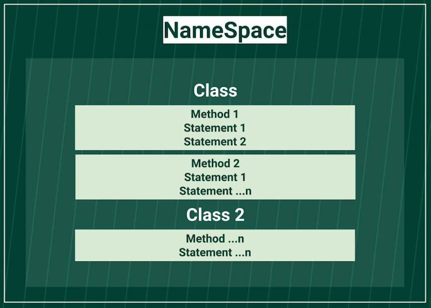
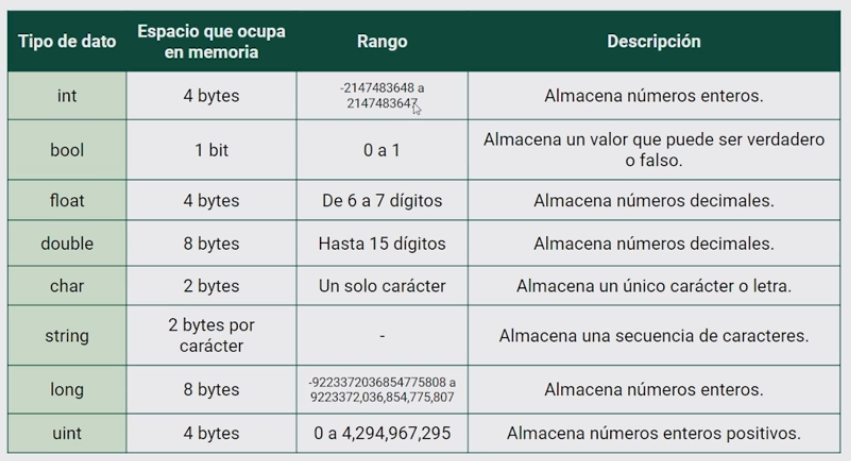
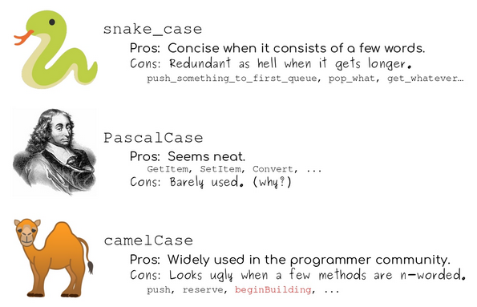

# Introduccion a C#

https://docs.microsoft.com/es-es/dotnet/csharp/tour-of-csharp/

## Namespaces en C#

**Namespace:** Tiene que representar algo significativo para el programa, con un nombre único. Cada Namespace puede tener diferentes clases, tantas como requiera el programa.



**Clases:** Las clases son plantillas para crear entidades, tantas como se requiera. Cada clase puede tener diferentes métodos.

**Métodos:** La forma o manera de ejecutar funcionalidades del programa.

## Lógica de programación

### Tipos de datos



### Variables



```cs
Console.WriteLine("What is your name?");
var name = Console.ReadLine();
Console.WriteLine("hello "+ name + " Welcome!");
```

```cs
int number1;
int number2;
Console.WriteLine("First number");
number1 = Convert.ToInt32(Console.ReadLine());

Console.WriteLine("First number");
number2 = Convert.ToInt32(Console.ReadLine());

int result = number1 + number2;
Console.WriteLine("Result: " + result);
```

### Arreglos en C#

```cs
string[] = coffeTypes;
coffeTypes = new string[]{"Expreso", "Largo", "Filtrado", "Latte" };
```

### Listas

```cs
List<string> tacoShoppingList = new List<string>();
tacoShoppingList.Add("1 Taco de suadero");
tacoShoppingList.Add("2 Tacos de Pastror");
tacoShoppingList.Add("3 Tacos de campechano");
tacoShoppingList.Add("4 Coca Colas");

tacoShoppingList.RemoveAt(0);
```

### Metodos

```cs
Random rnd = new Random();
Console.WriteLine("Una valor random: ${rnd.Next(1,10)}");
```

### Métodos de strings

[Aqui](metodos-string.md)

### Crear metodos

```cs
public void IntegerAddition(int a, int b)
{
    int Addition = a + b;
    Console.WriteLine("El resultado es " + Addition);
}
```

**Métodos que retornan un valor**

```cs
public int IntegerMultiplication(int a, int b)
{
    int Multiplication = a * b;
    return Multiplication;
}
```

## Bucles y estructuras de control en C#

```cs
if(opcion == '+' || opcion == '-' || opcion == '*' || opcion == '/' || opcion == '%')
{
    Console.WriteLine($"({opcion}) Opción valida");
    //return;
} else {
    Console.Write("Opción no valida");
    return;
}
```

### Switch

```cs
Console.WriteLine("Enter the selected soda: ");
string caseSwitch = Console.ReadLine();
switch (caseSwitch)
{
    case "cola":
        Console.WriteLine("Cola soda - $2 USD");
        break;
    case "lime":
        Console.WriteLine("Lime soda - $1 USD");
        break;
    case "orange":
        Console.WriteLine("Orange soda - $1.5 USD");
        break;
    case "apple":
        Console.WriteLine("Apple soda - $1 USD");
        break;
    default:
        Console.WriteLine("ERROR: You did not select a soda or you entered an incorrect value.");
        break;
}
```

### Ciclo for

```cs
for (int i = 0, j = 0; i < 10 && j > -10; i++, j--)
{
    Console.WriteLine("i: "+i+" j: "+j);
}
```

### Ciclo while

```cs
int limit = 100;
int contador = 0;
int potencia = 2 * contador;

while (potencia < limit)
{
    Console.Write(potencia);
    contador ++;
    potencia = 2 * contador;
}
```
